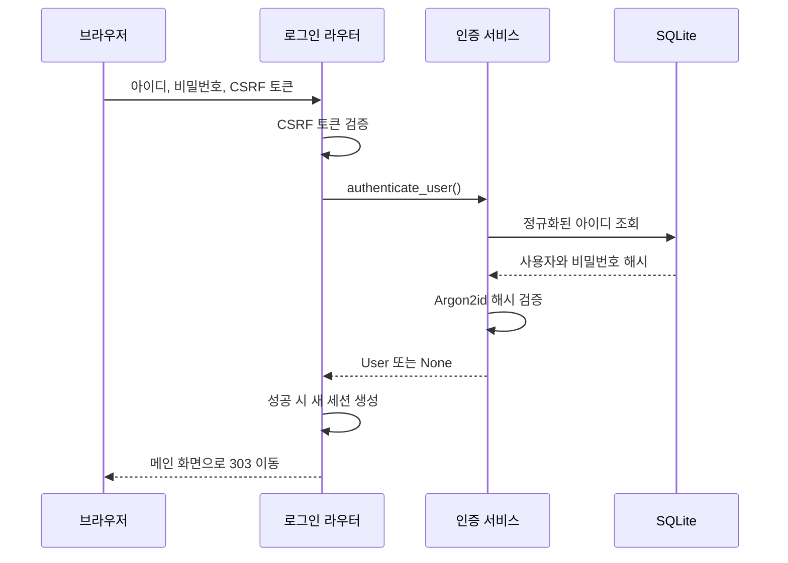

# 인증 구조와 발전 방향

## 1. 문서 목적

이 문서는 현재 회원가입·로그인·로그아웃이 어떻게 처리되는지 설명하고,
서비스 규모와 보안 요구가 커졌을 때 개선할 수 있는 방향을 정리합니다.

현재 구현은 과제 범위에 맞춰 다음 기능에 집중합니다.

- 아이디와 비밀번호를 사용한 회원가입 및 로그인
- Argon2id 비밀번호 해시
- 서명 쿠키를 이용한 로그인 상태 유지
- 폼 요청에 대한 CSRF 방어
- 메인 화면에서 현재 로그인 사용자 확인

이메일 인증, 비밀번호 재설정, 다중 인증과 로그인 시도 제한은 아직 구현하지
않았습니다.

## 2. 구성 요소와 역할

| 구성 요소 | 역할 |
| --- | --- |
| `app/services/auth.py` | 입력 정책 검증, 사용자 등록, 비밀번호 확인, 사용자 조회 |
| `app/auth.py` | 세션 생성·삭제, 현재 사용자 조회, CSRF 토큰 관리 |
| `app/routers/auth.py` | 인증 화면과 요청 처리, 상태 코드와 화면 이동 결정 |
| `app/main.py` | 세션 미들웨어 및 쿠키 정책 설정 |
| `app/schema.sql` | `users` 테이블과 데이터 무결성 제약 정의 |

라우터는 HTTP 요청과 응답을 담당하고, 서비스는 인증 규칙과 DB 처리를
담당합니다. 세션 관련 처리는 별도 모듈로 분리해 이후 보호된 페이지에서도
같은 로직을 재사용할 수 있도록 구성했습니다.

## 3. 회원가입 처리

`POST /signup` 요청은 다음 순서로 처리합니다.

1. 폼의 CSRF 토큰과 세션의 토큰을 안전하게 비교합니다.
2. 이미 로그인한 사용자라면 메인 화면으로 이동시킵니다.
3. 아이디를 정규화하고 아이디·비밀번호 정책을 검증합니다.
4. 서비스에서 동일한 아이디가 있는지 먼저 조회합니다.
5. 비밀번호 원문을 Argon2id로 해시한 뒤 `users` 테이블에 저장합니다.
6. 가입에 성공하면 `303` 응답으로 로그인 화면에 이동시킵니다.

아이디 중복은 두 단계로 방어합니다.

- 서비스의 사전 조회는 일반적인 중복 요청을 빠르게 처리하고 불필요한
  비밀번호 해시 연산을 피합니다.
- DB의 `UNIQUE` 제약은 두 가입 요청이 동시에 사전 조회를 통과하더라도
  최종적으로 중복 데이터가 저장되지 않도록 보장합니다.

검증 실패는 `400`, 중복 아이디는 `409`로 처리합니다. 오류가 발생한 경우
아이디만 화면에 다시 표시하며 비밀번호는 응답에 포함하지 않습니다.

## 4. 로그인 처리

`POST /login` 요청은 다음 흐름을 따릅니다.

`authenticate_user()`는 다음 작업만 담당합니다.

1. 아이디의 앞뒤 공백을 제거하고 소문자로 변환합니다.
2. 입력값이 기본 아이디·비밀번호 정책을 따르는지 확인합니다.
3. DB에서 사용자를 조회합니다.
4. 입력된 비밀번호를 저장된 Argon2id 해시와 비교합니다.
5. 인증 성공 시 비밀번호 해시를 제외한 `User` 객체를 반환합니다.
6. 정책 위반, 존재하지 않는 사용자 또는 잘못된 비밀번호에는 `None`을
   반환합니다.

존재하지 않는 아이디에도 더미 Argon2 검증을 실행합니다. 사용자가 없을 때만
해시 연산을 생략하면 응답 시간 차이를 통해 가입된 아이디를 추측할 수 있기
때문입니다. 더미 비밀번호는 실제 사용자 정보나 비밀값이 아니며, 느린 해시
검증 비용을 비슷하게 맞추기 위한 고정 입력입니다.

로그인 실패 원인은 외부에 구분해 보여주지 않고 항상
“아이디 또는 비밀번호가 올바르지 않습니다”라는 메시지와 `401` 상태로
응답합니다. 아이디 존재 여부가 오류 메시지를 통해 노출되는 것을 막기
위해서입니다.

## 5. 로그인 상태 유지

인증에 성공하면 `establish_user_session()`이 기존 세션을 비우고 다음 값만
새 세션에 저장합니다.

- `user_id`: 로그인 사용자의 DB 식별자
- `csrf_token`: 이후 POST 폼을 검증하기 위한 무작위 토큰

Starlette의 `SessionMiddleware`가 세션 내용을 서명한 쿠키로 브라우저에
전달합니다. 현재 쿠키 설정은 다음과 같습니다.

- 쿠키 이름: `codyssey_session`
- 유효기간: 8시간
- `HttpOnly`: 브라우저의 JavaScript에서 접근 제한
- `SameSite=Lax`: 일반적인 교차 사이트 요청에서 쿠키 전송 제한
- `Secure`: `SESSION_HTTPS_ONLY=true`인 HTTPS 환경에서 활성화

서명은 쿠키 변조를 탐지하지만 내용을 암호화하지는 않습니다. 따라서 세션에는
비밀번호 해시나 개인정보를 넣지 않고 사용자 ID와 CSRF 토큰만 저장합니다.

메인 화면을 요청할 때는 쿠키에서 얻은 `user_id`로 사용자를 다시 조회합니다.
해당 사용자가 DB에 없다면 잘못되거나 더 이상 유효하지 않은 세션으로 판단해
세션을 비웁니다. 로그아웃은 반드시 CSRF 검증을 거친 `POST /logout`으로
처리하고 세션 전체를 삭제합니다.

`SESSION_SECRET`은 쿠키 서명의 신뢰 기반이므로 32자 이상의 예측하기 어려운
값을 사용하고 저장소에 커밋하지 않습니다. 이 값을 변경하면 기존 쿠키의
서명을 더 이상 검증할 수 없으므로 모든 사용자가 다시 로그인해야 합니다.

## 6. 현재 방식의 한계

현재의 서명 쿠키 세션은 별도의 세션 테이블 없이 구현할 수 있어 단순하지만
다음과 같은 한계가 있습니다.

- 서버가 특정 사용자의 특정 로그인 세션만 즉시 폐기하기 어렵습니다.
- 로그인된 기기 목록이나 마지막 활동 시각을 서버에서 관리할 수 없습니다.
- 모든 세션을 무효화하려면 `SESSION_SECRET`을 바꿔 전체 사용자를 로그아웃시키는
  방식에 의존하게 됩니다.
- 로그인 실패 횟수 제한, 감사 로그, 비밀번호 재설정과 계정 복구 기능이
  없습니다.
- 여러 서버 인스턴스로 확장할 경우 모든 서버가 동일한 세션 서명 키와 DB를
  안전하게 공유해야 합니다.

현재는 매 요청마다 사용자 정보를 DB에서 다시 확인하므로, 삭제된 사용자의
세션은 다음 요청에서 정리할 수 있습니다. 다만 개별 기기 세션 제어처럼 더
세밀한 관리는 제공하지 않습니다.

## 7. 향후 발전 방향

### 7.1 채팅 기능을 보호할 때

다음 단계에서는 `get_current_user()`를 기반으로 로그인 사용자를 요구하는 공통
의존성 또는 가드를 만듭니다. HTML 페이지는 로그인 화면으로 이동시키고,
API는 `401 Unauthorized`를 반환하도록 요청 유형에 따라 동작을 구분할 수
있습니다. 이후 `/chat`과 대화 기록 조회에 이 접근 제어를 적용합니다.

### 7.2 기본 운영 보안을 강화할 때

- 운영 환경에서는 HTTPS를 사용하고 `SESSION_HTTPS_ONLY=true`를 적용합니다.
- 아이디 또는 IP 기준 로그인 시도 제한과 점진적인 대기 시간을 도입합니다.
- 로그인 성공·실패, 로그아웃, 비밀번호 변경 같은 보안 이벤트를 기록합니다.
- 비밀번호 재설정과 이메일 인증 과정에 짧은 유효기간의 일회용 토큰을
  사용합니다.
- 해시 설정이 변경됐는지 로그인 시 확인하고 필요한 경우 최신 Argon2 설정으로
  다시 해시합니다.
- DB 구조 변경은 직접 수정하지 않고 마이그레이션 도구로 관리합니다.

### 7.3 개별 세션 제어가 필요할 때

강제 로그아웃, 기기별 세션 목록, 관리자에 의한 세션 폐기 또는 여러 서버
인스턴스 운영이 필요해지면 서버 측 세션 저장소를 도입할 수 있습니다.

이 경우 브라우저 쿠키에는 예측할 수 없는 세션 식별자만 저장하고, DB 또는
Redis에는 다음과 같은 정보를 관리합니다.

- 세션 식별자의 안전한 해시
- 사용자 ID
- 생성 시각, 마지막 활동 시각과 만료 시각
- 폐기 여부
- 필요할 경우 기기 이름, IP와 User-Agent 같은 보안 확인 정보

서버 측 세션을 사용하면 특정 세션만 즉시 무효화할 수 있고 여러 기기의 로그인
상태도 관리할 수 있습니다. 반면 세션 조회 비용, 만료 데이터 정리, 저장소 장애
대응이 추가되므로 현재 과제 규모에서는 서명 쿠키 방식이 더 단순하고
합리적입니다.

### 7.4 계정 보안 요구가 커질 때

- 이메일 또는 인증 앱을 이용한 다중 인증
- OAuth 기반 소셜 로그인
- WebAuthn 기반 패스키
- 유출된 비밀번호 차단 목록 확인
- 중요한 작업 전 비밀번호 재확인
- 관리자와 일반 사용자를 구분하는 역할 기반 권한 관리

이 기능들은 로그인 성공 여부를 확인하는 인증과, 사용자가 특정 작업을 수행할
수 있는지 판단하는 인가를 분리한 뒤 단계적으로 추가합니다.

## 8. 현재 구현 관련 파일

- [인증 서비스](../app/services/auth.py)
- [세션 및 CSRF 처리](../app/auth.py)
- [인증 라우터](../app/routers/auth.py)
- [애플리케이션과 세션 설정](../app/main.py)
- [사용자 테이블 스키마](../app/schema.sql)
- [인증 서비스 테스트](../tests/test_auth_service.py)
- [인증 화면 테스트](../tests/test_auth_routes.py)
