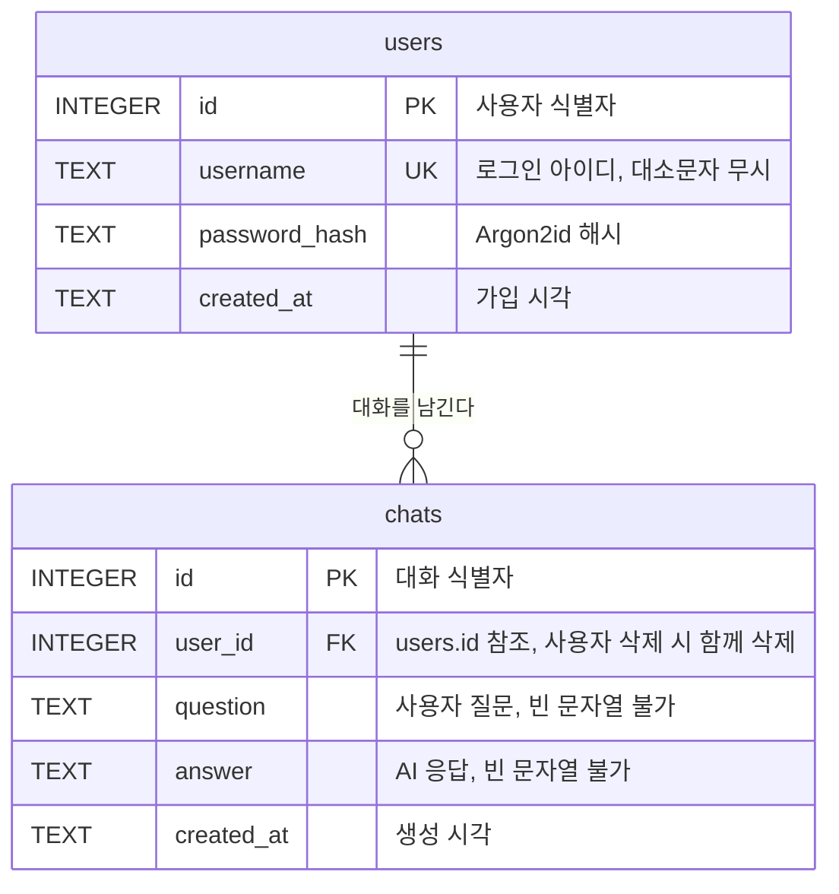

# 데이터베이스 구조와 설계 근거

## 1. 문서 목적

이 문서는 현재 SQLite 스키마가 어떤 데이터를 어떤 제약으로 저장하는지
설명하고, 그렇게 정한 이유와 현재 방식의 한계를 정리합니다.

현재 스키마는 다음 두 가지를 담당합니다.

- 회원가입·로그인에 사용하는 사용자 계정
- 사용자 질문과 AI 응답의 누적 대화 기록

대화방 구분, 실패한 AI 호출 기록, 질문 본문 검색과 대화 요약 저장은 아직
구현하지 않았습니다.

## 2. 테이블 구조

### 2.1 `users`

| 컬럼 | 타입 | 제약 | 설명 |
| --- | --- | --- | --- |
| `id` | INTEGER | PRIMARY KEY | 사용자 식별자 |
| `username` | TEXT | NOT NULL, COLLATE NOCASE, UNIQUE | 로그인 아이디. 대소문자를 구분하지 않음 |
| `password_hash` | TEXT | NOT NULL | Argon2id 해시. 원문은 저장하지 않음 |
| `created_at` | TEXT | NOT NULL, DEFAULT CURRENT_TIMESTAMP | 가입 시각 |

### 2.2 `chats`

| 컬럼 | 타입 | 제약 | 설명 |
| --- | --- | --- | --- |
| `id` | INTEGER | PRIMARY KEY | 대화 식별자 |
| `user_id` | INTEGER | NOT NULL, `users(id)` 참조, ON DELETE CASCADE | 대화 소유자 |
| `question` | TEXT | NOT NULL, CHECK(`length(question) > 0`) | 사용자 질문 |
| `answer` | TEXT | NOT NULL, CHECK(`length(answer) > 0`) | AI 응답 |
| `created_at` | TEXT | NOT NULL, DEFAULT CURRENT_TIMESTAMP | 생성 시각 |

과제 요구사항이 정한 최소 추적 필드는 사용자 식별, 생성 시각, 질문, 응답
네 가지이며 `chats`가 이를 모두 담습니다.

### 2.3 관계



모든 대화는 소유자가 반드시 한 명 있으며, 질문을 하지 않은 사용자는 대화를
하나도 갖지 않을 수 있습니다. `ON DELETE CASCADE`를 지정해 사용자가 삭제되면
그 사용자의 대화도 함께 삭제됩니다.

계정 삭제 기능은 아직 없지만, 삭제 정책을 명시하지 않으면 SQLite 기본값인
삭제 거부가 적용되어 이후 탈퇴 기능을 추가할 때 사용자 삭제가 실패합니다.

### 2.4 인덱스

| 인덱스 | 대상 | 용도 |
| --- | --- | --- |
| `idx_chats_user_created` | `chats (user_id, created_at)` | 사용자별 최근 대화 조회 |

## 3. 조회 패턴과 정렬 기준

`chats`에 대한 읽기는 모두 "특정 사용자의 대화를 최신순으로" 형태입니다.
최근 대화로 문맥을 구성할 때와 사용자가 자신의 기록을 조회할 때 모두 같은
질의를 사용합니다.

```sql
SELECT question, answer, created_at
FROM chats
WHERE user_id = ?
ORDER BY created_at DESC, id DESC
LIMIT ?;
```

### 3.1 `id`를 보조 정렬 기준으로 사용하는 이유

`CURRENT_TIMESTAMP`는 `2026-09-08 04:31:37` 형식의 초 단위 문자열이며 밀리초를
포함하지 않습니다. 따라서 같은 초에 저장된 행들은 `created_at` 값이 완전히
같아집니다. 실제로 세 건을 연속 저장했을 때 세 행의 `created_at`이 모두
동일했습니다.

이 상태에서 `ORDER BY created_at DESC`만 사용하면 정렬 근거가 없어 저장 순서가
그대로 반환됩니다. 여기에 `LIMIT`을 적용하면 최근 대화를 요청했는데 가장
오래된 대화를 받게 됩니다.

`id`는 `INTEGER PRIMARY KEY`이므로 새 행마다 기존 최댓값보다 큰 값이 부여되며,
입력 순서를 정확히 보존합니다. `created_at`이 같을 때 `id`가 순서를 결정하도록
두 컬럼을 함께 정렬 기준으로 사용합니다.

### 3.2 인덱스 컬럼 순서

복합 인덱스는 앞쪽 컬럼부터 순서대로 사용되므로, 먼저 범위를 좁히는 컬럼이
앞에 와야 합니다. 모든 질의가 `user_id`로 한 사용자를 고른 뒤 시간순으로
정렬하므로 `(user_id, created_at)` 순서를 사용합니다.

### 3.3 인덱스에 `id`를 넣지 않은 이유

정렬 기준이 `created_at`과 `id` 두 개이므로 인덱스에도 `id`를 넣어야 할 것으로
보이지만 필요하지 않습니다. `id`가 `INTEGER PRIMARY KEY`이면 SQLite에서 rowid의
별칭이 되고, SQLite는 모든 인덱스 항목 끝에 rowid를 자동으로 덧붙입니다. 즉
`(user_id, created_at)` 인덱스는 내부적으로 이미 `(user_id, created_at, id)`
순서를 갖습니다.

`EXPLAIN QUERY PLAN`으로 확인한 결과 두 경우의 실행 계획이 동일했으며, 어느
쪽도 별도 정렬 단계를 필요로 하지 않았습니다.

## 4. 설계 결정

### 4.1 질문과 응답을 한 행에 저장

대화를 `role`과 `content`를 갖는 메시지 단위로 쪼개는 방식도 가능하지만,
질문과 응답을 한 행에 함께 저장하는 방식을 선택했습니다.

과제 요구사항이 정한 최소 추적 필드가 "질문"과 "응답"이므로 컬럼이 요구사항에
그대로 대응하고, 화면에 표시할 때 질문과 응답의 짝을 다시 맞출 필요가
없습니다. AI 요청에 넣을 문맥을 만들 때는 한 행을 두 개의 메시지로 펼치면
되므로 변환 비용이 작습니다.

### 4.2 대화방 테이블을 두지 않음

과제 요구사항은 문맥 유지 방식으로 "최근 N개의 대화, 같은 사용자/세션의 직전
Q/A 등"을 허용하며 구현 방식을 팀 선택에 맡깁니다. 사용자 단위로 대화를
관리하면 요구사항을 충족하므로 대화방 개념을 도입하지 않았습니다.

대화방을 도입하면 테이블이 하나 늘어나는 데 그치지 않고 화면, 채팅 API,
문맥 구성, 기록 조회가 모두 대화방 단위로 바뀝니다. 요구사항이 요구하지 않는
범위 확장이라 판단했습니다.

### 4.3 실패한 AI 호출을 저장하지 않음

AI 호출이 실패한 요청은 `chats`에 남기지 않습니다. 채팅 API의 완료 조건이
성공한 질문과 응답의 저장이며, 실패 이력은 서버 로그로 추적하기 때문입니다.

그 결과 `answer`를 `NOT NULL`로 둘 수 있어 조회하는 쪽에서 NULL을 처리할
필요가 없습니다. 두 컬럼에는 빈 문자열도 저장되지 않도록 `CHECK` 제약을
두었습니다. 입력 검증은 애플리케이션에서 수행하지만, 아이디 중복을 `UNIQUE`
제약으로 최종 방어하는 것과 같은 이유로 DB에도 제약을 둡니다.

## 5. 초기화 절차

`app/database.py`의 `init_db()`가 `app/schema.sql`을 `executescript()`로
실행합니다. 데이터베이스 파일은 기본적으로 `data/codyssey.db`에 생성되며
`.gitignore`에 포함되어 저장소에 올라가지 않습니다.

- 모든 DDL이 `IF NOT EXISTS`이므로 반복 실행해도 기존 데이터를 지우지
  않습니다. 애플리케이션을 재시작해도 데이터가 유지됩니다.
- `get_connection()`이 연결마다 `PRAGMA foreign_keys = ON`을 실행합니다.
  SQLite는 외래키 검사가 기본으로 꺼져 있어, 이 설정이 없으면 스키마에
  외래키를 정의해도 오류 없이 무시됩니다.

두 번째 항목 때문에 테스트에서도 반드시 `get_connection()`을 거쳐야 합니다.
`sqlite3.connect()`를 직접 호출하면 외래키 검사가 꺼진 연결이 만들어져 관련
검증이 아무것도 확인하지 못합니다.

## 6. 현재 방식의 한계

- 스키마 변경 수단이 테이블과 인덱스 추가뿐입니다. `IF NOT EXISTS`는 이미
  존재하는 테이블을 건너뛰므로, 기존 컬럼의 타입이나 제약을 바꾸려면 별도의
  마이그레이션 절차가 필요합니다.
- 실패한 AI 호출을 저장하지 않으므로 DB만으로는 실패 이력이나 실패율을 알 수
  없고 서버 로그를 확인해야 합니다.
- 대화방 구분이 없어 사용자당 하나의 연속된 대화 흐름만 표현할 수 있습니다.
- 인덱스가 `(user_id, created_at)` 하나뿐이라 질문 본문 검색은 전체 스캔이
  필요합니다.
- `created_at`이 초 단위라 대화의 정확한 소요 시간이나 응답 지연을 DB에서
  분석할 수 없습니다.

## 7. 향후 발전 방향

### 7.1 채팅 기능이 붙을 때

채팅 API는 로그인 사용자의 `user_id`와 질문, AI 응답을 `chats`에 저장합니다.
`created_at`은 기본값이 채우므로 별도로 지정하지 않습니다.

문맥 유지 기능은 3장의 질의로 최근 N개를 읽어 시간순으로 뒤집은 뒤 AI 요청에
넣습니다. 기록 조회 기능은 같은 질의에서 `LIMIT`만 제거해 사용하며, `WHERE
user_id = ?` 조건이 다른 사용자의 대화가 노출되지 않도록 보장합니다.

### 7.2 대화방 구분이 필요해질 때

사용자가 주제별로 대화를 나누기를 원한다면 `conversations` 테이블을 추가하고
`chats`에 `conversation_id` 외래키를 두는 방식으로 확장할 수 있습니다. 이때
인덱스도 `(conversation_id, created_at)` 기준으로 다시 검토해야 합니다.

### 7.3 검색과 분석이 필요해질 때

질문 본문 검색이 필요해지면 SQLite의 FTS5 가상 테이블을 별도로 두고 `chats`와
동기화하는 방식을 사용할 수 있습니다. 응답 지연 분석이 필요하다면 `created_at`을
밀리초까지 저장하거나 소요 시간 컬럼을 추가하는 방법을 검토합니다.

## 8. 현재 구현 관련 파일

- [스키마 정의](../app/schema.sql)
- [연결 및 초기화](../app/database.py)
- [데이터베이스 테스트](../tests/test_database.py)